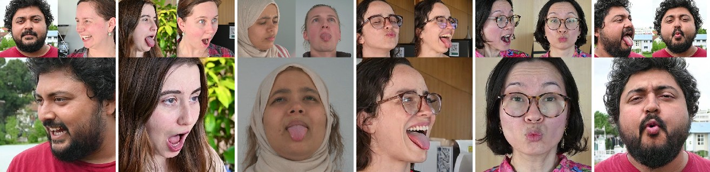

## ___***Joker: Conditional 3D Head Synthesis with Extreme Facial Expressions***___
<div align="center">

</img>

 <a href='https://arxiv.org/abs/2410.16395'></a> &nbsp;
 <a href='https://malteprinzler.github.io/projects/joker/'></a> &nbsp;
 <a href='https://malteprinzler.github.io/projects/joker/#video'></a>&nbsp;
 <a href='#citation'></a>&nbsp;

_**[Malte Prinzler](https://malteprinzler.github.io/), [Egor Zakharov](https://egorzakharov.github.io/), [Vanessa Sklyarova](https://vanessik.github.io/), [Berna Kabadayi](https://bernakabadayi.github.io/), [Justus Thies](https://justusthies.github.io/)**_
<br>
3DV 2025
<br>


</div>
<br>


# Installation

### Install the conda environment
(only tested for linux)

If you havn't done so already, install conda following the instructions from [here](https://docs.conda.io/projects/conda/en/latest/user-guide/install/index.html).
```
git clone https://github.com/malteprinzler/joker.git
cd joker
conda env create -f environment.yaml  # this might take a while ...
conda activate joker

# in case gcc version 9 is not installed on your machine, follow https://askubuntu.com/questions/1140183/install-gcc-9-on-ubuntu-18-04 to install it

# installing packages that require a bit more love
export CUDA_HOME=$CONDA_PREFIX
export GCC=gcc-9
export CC=gcc-9
export CXX=g++-9
pip install git+https://github.com/facebookresearch/pytorch3d.git@e13848265d9d57927fca99d13061e8fba8d468d0
pip install git+https://github.com/NVlabs/tiny-cuda-nn/@2ec562e853e6f482b5d09168705205f46358fb39#subdirectory=bindings/torch
pip install git+https://github.com/KAIR-BAIR/nerfacc.git@d84cdf3afd7dcfc42150e0f0506db58a5ce62812

# registering joker as a package
pip install -e .
```

### Get pretrained models / preprocessed data
1. Download the pretrained weights of our diffusion prior from [here](https://keeper.mpdl.mpg.de/d/ef36c2fe25944366a088/) (download assets.zip) and put them into the `assets/` directory. Afterwards, we expect a folder structure as follows:
```
assets
|
|
└───joker
    │
    └─── pretrained
        │
        └─── bfm_ft_NersembleCelebvtext_230000.bin
```

2. Download the example data from [here](https://keeper.mpdl.mpg.de/d/ef36c2fe25944366a088/) (download data.zip) and put it under the `data/` directory. Afterwards, we expect a folder structure as follows:
```
data
|
|
└─── PRIOR_EXAMPLE_DATA
│
└─── DISTILLATION_EXAMPLE_DATA
│
└─── CELEBV_TEXT
```
<br>

**(all steps below are optional: they are only required if you want to preprocess your own data)**

<br>

3. Our method uses [Deep3DFaceRecon](https://github.com/sicxu/Deep3DFaceRecon_pytorch) which requires the [Basel Face Model 2009 (BFM09)](https://faces.dmi.unibas.ch/bfm/main.php?nav=1-0&id=basel_face_model) to represent 3d faces. Get access to BFM09 using this [link](https://faces.dmi.unibas.ch/bfm/main.php?nav=1-2&id=downloads). After getting the access, download "01_MorphableModel.mat". In addition, we use an Expression Basis provided by [Guo et al.](https://github.com/Juyong/3DFace). Download the Expression Basis (Exp_Pca.bin) using this [link (google drive)](https://drive.google.com/file/d/1bw5Xf8C12pWmcMhNEu6PtsYVZkVucEN6/view?usp=sharing). Further download the pretrained Deep3DFaceRecon weights from [here](https://drive.google.com/drive/folders/1liaIxn9smpudjjqMaWWRpP0mXRW_qRPP?usp=sharing). Even better results may be obtained with their updated weights from [here](https://drive.google.com/drive/folders/1grs8J4vu7gOhEClyKjWU-SNxfonGue5F?usp=share_link) but we didnt test this. Organize all files into the following structure:
```
assets
|
|
└───Deep3DFaceRecon
    │
    └─── BFM
    │    │
    │    └─── 01_MorphableModel.mat
    │    │
    │    └─── Exp_Pca.bin
    │    |
    │    └─── ...
    │
    └─── checkpoints
         │    
         └─── pretrained
               │    
               └─── epoch_20.pth
               │    
               └─── test_opt.txt
               
```

<br>

4. We use [hyperIQA](https://github.com/SSL92/hyperIQA) for data filtering. Please download the checkpoint from [here](https://drive.google.com/file/d/1OOUmnbvpGea0LIGpIWEbOyxfWx6UCiiE/view) and store it under
```
assets
|
|
└───hyperIQA
    │
    └─── koniq_pretrained.pkl
```

<br>

5. We use [EMICA](https://github.com/radekd91/inferno/tree/master/inferno_apps/FaceReconstruction) for data filtering. Make sure you have registered and agreed to the license terms at https://flame.is.tue.mpg.de before downloading the model weights from [here](https://keeper.mpdl.mpg.de/d/ef36c2fe25944366a088/) (download assets.zip) and store them as
```
assets
|
|
└───inferno
    │
    └─── emonet
    │
    └─── FaceReconstruction
    │
    └─── FLAME
    │
    └─── MICA
```

<br>

6. We use [MODNet](https://github.com/ZHKKKe/MODNet) for automatic image matting. Please download the pretrained weights from [here](https://drive.google.com/drive/folders/1umYmlCulvIFNaqPjwod1SayFmSRHziyR?usp=sharing). You only need the `modnet_photographic_portrait_matting.ckpt` file; store it like:
```
assets
|
|
└───MODNet
    │
    └─── modnet_photographic_portrait_matting.ckpt
```

=> CONGRATS! YOU ARE DONE ;)


### (Optional but highly recommended) Register @wandb.ai for logging
Per default, we use [wandb](https://wandb.ai/) for logging which requires you to set up an account there (its free). While we also support tensorboard logging for the training of our 2D prior, we highly recommend you to set up a wandb account. 
Also, for 3D distillation other loggers are not implemented.

# Quickstart
Note that we conduct our experiments on an NVIDIA A100 80GB GPU (8 of them for training). If you use smaller GPUs you might have to reduce the batch size to avoid OOM errors. 

## 2D Inference with the pretrained 2D Prior on preprocessed data
</img>
- You can check out our gradio demo by running `python demo/2d_prior_demo/app.py`. If you prefer scripts, follow the steps below.
- make sure you have downloaded the pretrained model weights and the preprocessed samples following the installation instructions
- check the configuration in `configs/prior/inference_2dprior.yaml` and set the paths according to your needs
- run 
  ```
  python joker/prior/inference.py configs/prior/inference_2dprior.yaml
  ```
- by default, the results will be saved to `experiments/prior/EXAMPLE_PREDICTIONS`

## 3D Distillation of the pretrained 2D Prior on preprocessed data
</img>
- check the configuration in `configs/distillation/train.yaml` and set the paths according to your needs
- run 
  ```
  python joker/distillation/launch.py --config configs/distillation/train.yaml
  ```
- by default the results are saved under `experiments/distillation/pretrained/pretrained_0`
- after the optimization finished, edit `configs/distillation/test.yaml` and run
  ```
  python joker/distillation/launch.py --config configs/distillation/test.yaml
  ```
- this will render out the distilled NeRF. By default, results are stored under `experiments/distillation/pretrained/pretrained_0_test/save/`

# 2D prior inference on your own data
- To run the 2D prior on your own data, first create a folder containing reference and driving images with the following structure:
  ```
  000000_ref.jpg/png
  000000_drive.jpg/png
  000001_ref.jpg/png
  000001_drive.jpg/png
  ...
  ```
- To perform preprocessing (image cropping, 3DMM estimation & reenactment, prompt estimation, ...), run 
  ```
  python joker/prior/data/preprocess/preprocess_reenactment_folder.py \
  --in_dir <path to input data directory> \
  --out_dir <path to directory where processed files should be stored>
  ```
- follow the steps in the quickstart guide to run the 2D prior on the preprocessed data

# 3D Distillation on your own data
- To run the 3D distillation on your own data, run:
  ```
  python joker/distillation/data/preprocess/generate_distillation_dataset.py \
    --ref_path <path to reference image> \
    --targ_path <path to driving image> \
    --out_root <output directory>
  ```
  This will generate a folder similar to the ones provided under `data/DISTILLATION_EXAMPLE_DATA`
- Follow the steps in the quickstart guide to run the 3D distillation on the preprocessed data

# Training the 2D Prior yourself
We train the 2D Prior on two datasets: [CelebVText](https://celebv-text.github.io/) and [NeRSemble](https://tobias-kirschstein.github.io/nersemble/). The following section will provide guidance on how to download and preprocess both datasets, as well as how to train the 2D prior on the processed data. Note that we perform training on 8 A100 80GB GPUs for ~5 days.

## Preparing the training data

### CelebVText
- Download the raw videos by running
  ```
  python joker/prior/data/celebvtext/download.py 
  ```
  The script assumes the file `data/CELEBV_TEXT/celebvtext_info.json` to exist and will download the raw videos into `data/CELEBV_TEXT/VIDEOS`.
  Downloading CelebVText will take some time. Consider splitting the download into multiple jobs on a cluster and run it in parallel. The download file already contains the starting steps for doing so and should only require minor modification.
- Create a file containing a balanced list of 50k videos using
  ```
  python joker/prior/data/celebvtext/get_balanced_vidfilelist.py
  ```
  Balanced in this case means from as many different original videos as possible. By default the results will be written to `data/CELEBV_TEXT/50K_BALANCED_VIDEO_FILES.txt`. Note that while we provide a precomputed version of this file, due to the changing availability of videos on youtube, our file may be referring to unavailable videos so we recommend you to recalculate it.
- Extract the raw frames from 50k videos by running 
  ```
  python joker/prior/data/celebvtext/extract_raw_frames.py 
  ```  
- Run frame preprocessing: 
  - get list of all frames through 
    ```
    python joker/prior/data/preprocess/get_allframestxt.py
    ```
    this will write an `ALL_FRAMES.txt` to the data directory
  - run the preprocessing script which will do the cropping, 3DMM estimation, captioning, ...: 
    ```
    python joker/prior/data/preprocess/preprocess_dataset.py 
    ```
    Again this can take some time if you run it for a bigger dataset. Starting points to parallelize this procedure are provided in the script.
- filtering, sorting, and train-val splitting
  - filter the processed files for valid samples: 
    ```
    python joker/prior/data/preprocess/filter_valid_frames.py 
    ``` 
    Filtering is performed based on lmks lying inside the bounding box, plausible 3dmm parameter estimations, existence of all required files and hyperiqa scores.
  - Get diversity and expressiveness meta information for the generated frames by running 
    ```
    python joker/prior/data/preprocess/get_divex_metas.py 
    ```
    This will generate the file `VALID_DIVEX_METAS.json` in the data directory. 
  - Annotate neutral-frame arcface feats by running 
    ```
    python joker/prior/data/celebvtext/annotate_subject_arcface_feats.py
    ```
    This step is necessary to avoid identity overlap in the train-val split for celebvtext.
  - Get the celebvtext train-val split by running 
    ```
    python joker/prior/data/celebvtext/get_celebvtext_trainval_split.py
    ```
    This will generate the files `data/CELEBV_TEXT/PROCESSED_FRAMES_50K/VAL_METAS.json` and `TRAIN_METAS.json`
- YOU'RE DONE :)

 
### NeRSemble
- Download the dataset by following the instructions from [here](https://github.com/tobias-kirschstein/nersemble?tab=readme-ov-file#2-dataset). For the next steps, we assume that you put the videos into `data/NERSEMBLE/VIDEOS` with the following data structure
    ```
    data
      - NERSEMBLE
        - VIDEOS
          - 017
            - BACKGROUND
            - EMO-1-shout+laugh
            - ...
          - 018
          - ...
    ```
- Extract the raw video frames from expressive sequences using
  ```
  python joker/prior/data/nersemble/extract_raw_frames.py
  ```
  This can again take some time, so parallelization makes sense. A starting point for this is provided in the script.
- Get the `ALL_FRAMES.txt` by running 
  ```
  python joker/prior/data/preprocess/get_allframestxt.py \
    --root data/NERSEMBLE/RAW_FRAMES_EXPR_10K
  ```
- Run the preprocessing script: 
  ```
  python joker/prior/data/preprocess/preprocess_dataset.py \
    --in_root data/NERSEMBLE/RAW_FRAMES_EXPR_10K \
    --out_root data/NERSEMBLE/PROCESSED_FRAMES_EXPR_10K \
    --frame_file data/NERSEMBLE/RAW_FRAMES_EXPR_10K/ALL_FRAMES.txt 
  ``` 
  Again this can take some time if you run it for a bigger dataset. Starting points to parallelize this procedure are provided in the script.
- Filtering, sorting, and train-val splitting
  - Filter the processed files for valid samples:
    ```
    python joker/prior/data/preprocess/filter_valid_frames.py \
      --root data/NERSEMBLE/PROCESSED_FRAMES_EXPR_10K \
      --frame_file data/NERSEMBLE/PROCESSED_FRAMES_EXPR_10K/ALL_FRAMES.txt \
      --out_file data/NERSEMBLE/PROCESSED_FRAMES_EXPR_10K/VALID_FRAMES.txt 
    ```
  - Get diversity and expressiveness meta information for the generated frames by running 
    ```
    python joker/prior/data/preprocess/get_divex_metas.py \
      --cam_name cam_222200037 \
      --tongue_bonus 1. \
      --root data/NERSEMBLE/PROCESSED_FRAMES_EXPR_10K \
      --frame_file data/NERSEMBLE/PROCESSED_FRAMES_EXPR_10K/VALID_FRAMES.txt \ 
      --out_path data/NERSEMBLE/PROCESSED_FRAMES_EXPR_10K/VALID_DIVEX_METAS.json
    ```
    Importantly note the specified cam_name (cam_222200037 is the frontal camera) and the tongue bonus of 1. (adding 1. to divex score if "tongue" keyword in caption).
  - Get the train_val split by running: 
    ```
    python joker/prior/data/nersemble/get_nersemble_trainval_split.py 
    ```
    This will generate the files `data/NERSEMBLE/PROCESSED_FRAMES_EXPR_10K/VAL_METAS.json` and `TRAIN_METAS.json`
- YOU'RE DONE :)

## Running the training
- The training of the 2D prior is configured in `configs/prior/train_2dprior_celebvtext.yaml` and `configs/prior/finetune_2dprior_celebvtext_nersemble.yaml`. Check if your filepaths match. If you prefer to use tensorboard logging over wandb, comment out the wandb logging section and uncomment the tensorboard logging section.  
- For the first training stage (CelebVText only), run 
  ```
  python multi_gpu.py joker/prior/train.py configs/prior/train_2dprior_celebvtext.yaml
  ```
  Note that our model is trained on 8 A100 80GB GPUs. If you want to reduce the nr of GPUs, change the `accelerate_kwargs.num_processes` entry in the config file. If you face OOM errors, try reducing the batch size and use the gradient_accumulation_steps option. Training with our setup takes ~ 4 days.
- For the second training stage (CelebVText + Nersemble), run
  ```
  python multi_gpu.py joker/prior/train.py configs/prior/finetune_2dprior_celebvtext_nersemble.yaml
  ```


# Citation
Please consider citing our paper if our code is useful:
```bib
@inproceedings{prinzler2025joker,
  title = {Joker: Conditional 3D Head Synthesis with Extreme Facial Expressions},
  author = {Prinzler, Malte and Zakharov, Egor and Sklyarova, Vanessa and Kabadayi, Berna and Thies, Justus},
  journal = {Proceedings of the International Conference on 3D Vision (3DV)},
  year = {2025},
  url = {https://malteprinzler.github.io/projects/joker/}
}
```