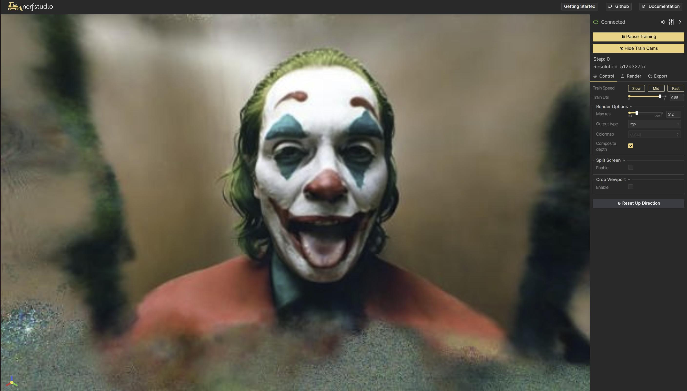

# Making a nerfstudio-compatible 3D representation out of the distillation result for interactive viewing

The goal is to enable interactive viewing of the distilled 3D representation with <a href='https://github.com/nerfstudio-project/nerfstudio'>nerfstudio</a>. 
However, since the threestudio representation that we natively optimize with our pipeline cannot be trivially converted into a nerfstudio-compatible representation (see <a href=https://github.com/threestudio-project/threestudio/issues/342>here</a>), we render out all training images with threestudio using the distilled 3D representation, and optimize a nerfacto representation against them using nerfstudio.

### set up a nerfstudio conda environment
follow the steps <a href='https://github.com/nerfstudio-project/nerfstudio?tab=readme-ov-file#1-installation-setup-the-environment'>here</a> to set up the conda environment.
in short: 

    conda create --name nerfstudio -y python=3.8
    conda activate nerfstudio
    pip install --upgrade pip
    pip install torch==2.1.2+cu118 torchvision==0.16.2+cu118 --extra-index-url https://download.pytorch.org/whl/cu118
    conda install -c "nvidia/label/cuda-11.8.0" cuda-toolkit
    pip install ninja git+https://github.com/NVlabs/tiny-cuda-nn/#subdirectory=bindings/torch
    pip install nerfstudio
    conda deactivate

### visualize preprocessed nerfstudio checkpoint
download the preprocessed `nerfstudio_ckpts.zip` from <a href='https://keeper.mpdl.mpg.de/d/ef36c2fe25944366a088'>here</a>, place it into the main directory of this project and unzip it. The ckpt files should be automatically placed in the `assets/joker/nerfstudio_ckpts` directory.

To visualize one of our prepared nerfstudio checkpoints run any of the following
    
    conda activate nerfstudio
    python demo/distillation_nerfstudio/viewer.py --load-config assets/joker/nerfstudio_ckpts/000/nerfacto/2025-01-31_110250/config.yml
    python demo/distillation_nerfstudio/viewer.py --load-config assets/joker/nerfstudio_ckpts/001/nerfacto/2025-01-31_110303/config.yml
    python demo/distillation_nerfstudio/viewer.py --load-config assets/joker/nerfstudio_ckpts/002/nerfacto/2025-01-31_110306/config.yml
    python demo/distillation_nerfstudio/viewer.py --load-config assets/joker/nerfstudio_ckpts/003/nerfacto/2025-01-31_110306/config.yml
    python demo/distillation_nerfstudio/viewer.py --load-config assets/joker/nerfstudio_ckpts/004/nerfacto/2025-01-31_110307/config.yml
    python demo/distillation_nerfstudio/viewer.py --load-config assets/joker/nerfstudio_ckpts/005/nerfacto/2025-01-31_110306/config.yml
    python demo/distillation_nerfstudio/viewer.py --load-config assets/joker/nerfstudio_ckpts/006/nerfacto/2025-01-31_110303/config.yml
    python demo/distillation_nerfstudio/viewer.py --load-config assets/joker/nerfstudio_ckpts/007/nerfacto/2025-01-31_110306/config.yml
    python demo/distillation_nerfstudio/viewer.py --load-config assets/joker/nerfstudio_ckpts/008/nerfacto/2025-01-31_110306/config.yml
    python demo/distillation_nerfstudio/viewer.py --load-config assets/joker/nerfstudio_ckpts/009/nerfacto/2025-01-31_110301/config.yml
    python demo/distillation_nerfstudio/viewer.py --load-config assets/joker/nerfstudio_ckpts/010/nerfacto/2025-01-31_110306/config.yml

### generating the target images for nerfstudio optimization
for generating the target images, run 
    
    conda activate joker
    python joker/distillation/launch.py --config configs/distillation/gen_nerfstudio_dataset.yaml

have a look at the config file and change the paths according to your needs.
By default, this will automatically render the images and store them under `experiments/distillation/example_data/example_data_000_nerfstudio/save/it020000-test`

### create nerfstudio dataset file
create the nerfstudio dataset file by running 
    
    conda activate joker
    python demo/distillation_nerfstudio/create_nerfstudio_dataset.py

by default, this will write the dataset file to `experiments/distillation/example_data/example_data_000_nerfstudio/nerfstudio_ds.json`

### run nerfstudio optimization
    conda activate nerfstudio
    ns-train nerfacto --output-dir experiments/nerfstudio --experiment-name 000 nerfstudio-data --data experiments/distillation/example_data/example_data_000_nerfstudio/nerfstudio_ds.json --auto-scale-poses False --center-method none --orientation-method none;
This will start the nerfstudio optimization, store the results under `experiments/nerfstudio/000` and will also provide a link to the interactive visualization tool

### view the optimization result
    conda activate nerfstudio
    ns-viewer --load-config {experiments/nerfstudio/.../config.yml}

